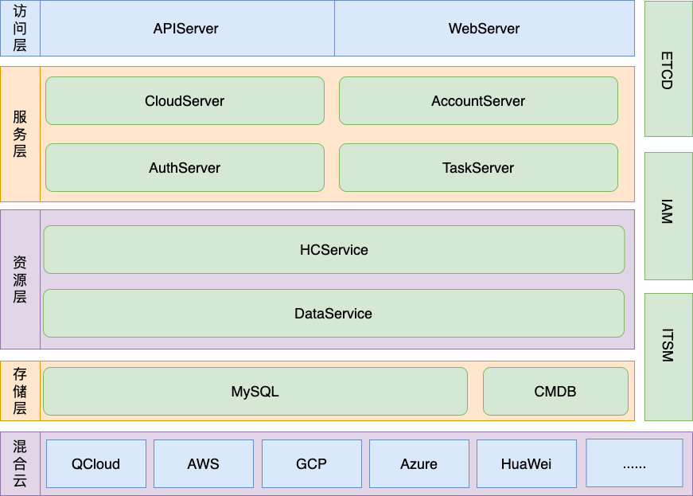

# 蓝鲸云管平台的架构设计

蓝鲸云管理平台整体为分层的微服务设计，可以分为以下四层：

1. **访问层**: 提供web服务界面和系统的API服务网关
    + web-server: 提供前端专用接口如查询用户、组织架构信息等功能，通过接入层调用系统中提供的API接口
    + api-server: 对外提供统一的API接口服务，将请求转发到服务层

2. **服务层**: 根据应用场景对资源管理层的原子接口进行封装提供服务，基于操作的相关度分为以下几种微服务:
    + cloud-server: 提供云资源相关业务场景操作，包括云资源的增删改查操作和创建异步任务申请云资源等场景，如创建云资源时需要调用cloud-service接口创建云资源，等待云资源创建成功后调用data-service接口写入数据，再调用CMDB的SDK将数据同步过去
    + auth-server: 提供权限相关功能
    + 待开发服务: admin-server（系统管理）、task-server（异步任务服务）

3. **资源层**: 对资源类型进行抽象和管理，提供原子接口服务，划分为以下几种微服务:
    + data-service: 负责操作DB数据，通过内置的DAO层操作数据，提供云资源数据操作的原子接口
    + hc-service: 负责对接云SDK，提供多云统一的云上资源操作的原子接口，并可以通过data-service将相关数据写入db
    + 待开发服务: event-server（云事件服务）

4. **基础设施层**: 提供系统所需的数据存储、第三方系统调用、服务发现等基础服务
    + MySQL: 数据库用于存储云资源数据
    + ETCD: 服务注册与发现功功能，从而使系统能保持高可用
    + 云: 需要对接多云进行云资源操作，数据均来自云云上。封装多云的云资源操作SDK为统一的SDK，由cloud-service使用对外提供服务
    + 第三方系统调用: 将第三方系统调用封装为SDK提供服务，目前需要对接以下几种第三方系统:
        + APIGateway: 蓝鲸API服务网关，所有第三方API均通过APIGateway进行调用，的前端front也通过APIGateway调用web-server进行用户验证
        + CMDB: 封装CMDB的查询业务、操作云主机等接口为SDK，由cloud-server使用封装场景
        + IAM: 封装IAM的鉴权接口为SDK，由auth-server使用进行鉴权。因为目前IAM无法进行用户认证，所以直接调用auth-server查询权限数据
        + ITSM: 通过可自定义设计的流程模块，覆盖IT服务中的不同管理活动或应用场景帮助企业用户规范内部管理流程，由cloud-server封装调用