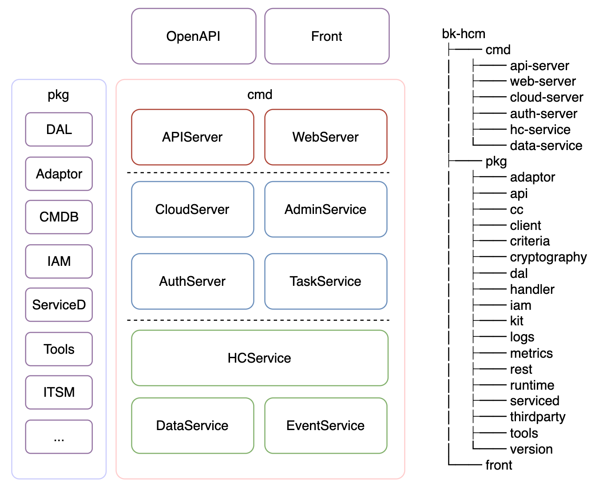

# 蓝鲸云管理平台

## 1. web-server & front
cmd/web-server是基于开源go-restful 框架构建，前端项目front基于vue.js构建

## 2. api_server
cmd/api-server基于开源go-restful 框架构建

## 3. 服务层
均基于go-restful框架构建，划分为以下微服务：
* cmd/cloud-server
* cmd/auth-server
* admin-server(待构建)
* task-server(待构建)

## 4. 资源层
均基于go-restful框架构建，划分为以下微服务：
* cmd/data-service
* cmd/hc-service
* event-server(待构建)

## 4. pkg

* api 服务协议的请求与响应结构体定义
* dal 封装mysql相关操作
* serviced 服务注册与发现相关操作
* adaptor 封装多云相关操作
* cc 配置中心相关操作
* criteria 枚举常量定义和错误校验
* handler http通用handler
* logs 日志相关操作
* rest http框架
* runtime 微服务运行时所需的工具
* version 版本信息
* cryptography 加密相关操作
* tools 封装通用工具
* metrics prometheus监控相关配置
* thirdparty 调用第三方相关操作
