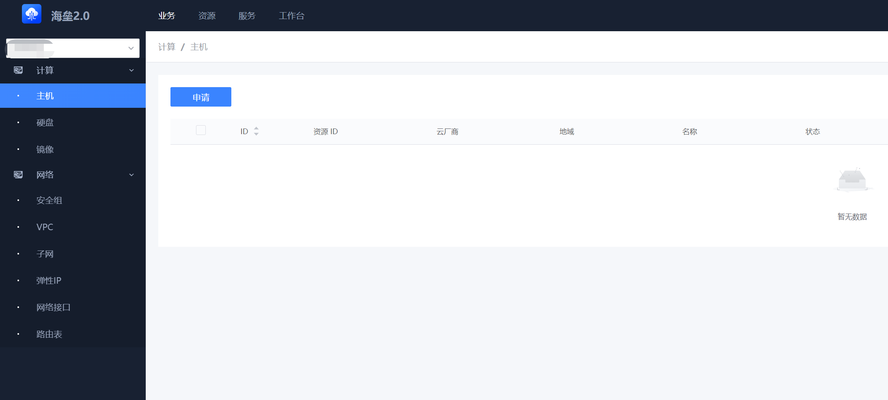

# HCM 部署文档

---

## 依赖第三方组件
* Mysql >= 8.0.17
* Etcd  >= 3.0.0
* Golang >= 1.18

## HCM 微服务进程清单

### 1. web层服务进程
* bk-hcm-webserver

### 2. 服务网关进程
* bk-hcm-apiserver

### 3. 场景服务进程
* bk-hcm-cloudserver
* bk-hcm-authserver

### 4. 资源管理进程
* bk-hcm-dataservice
* bk-hcm-hcservice

---

## 部署介绍
### 1. 部署Mysql
请参看官方资料 [Mysql](https://www.mysql.com/)

### 2. 部署Etcd
请参看官方资料 [Etcd](https://etcd.io/)

``` shell
curl -L ****** -o etcd.tar.gz

tar zxf etcd.tar.gz

nohup etcd --listen-client-urls http://127.0.0.1:2379 --advertise-client-urls http://127.0.0.1:2379 --auto-compaction-retention 1 --quota-backend-bytes 8589934592 &

```

### 3. Release包下载
官方发布的 **Linux Release** 包下载地址见[这里](https://github.com/TencentBlueKing/bk-hcm/releases), 具体的编译方法见[这里](source_compile.md)。

得到的文件结构如下：
```
bk-hcm/
├── api
│   └── api-server
│       ├── bk_apigw_resources_bk-hcm.yaml
│       ├── zh
│       │   └── list_secret_key.md
│       └── zh.tgz
├── bin
│   ├── bk-hcm-apiserver
│   ├── bk-hcm-authserver
│   ├── bk-hcm-cloudserver
│   ├── bk-hcm-dataservice
│   ├── bk-hcm-hcservice
│   └── bk-hcm-webserver
├── CHANGELOG.md
├── etc
│   ├── api_gw_public.key
│   ├── apiserver_api_gw_public.key
│   ├── api_server.yaml
│   ├── auth_server.yaml
│   ├── cloud_server.yaml
│   ├── data_service.yaml
│   ├── hc_service.yaml
│   └── web_server.yaml
├── install
│   ├── migrate.sh
│   └── sql
│       ├── 0001_20230227_2045_init_db.sql
│       ├── 0002_20230329_1510.sql
│       ├── 0003_20230516_1600.sql
│       ├── 0004_20230526_1410.sql
│       └── 0005_20230530_2100.sql
├── front
│   ├── index.html
│   └── css,img, ...
└── VERSION
```

## 运行效果


### 1. 初始化数据库

创建hcm需要的数据库，可以通过mysql命令行或者其他数据库管理工具完成。
```shell
CREATE DATABASE hcm;
```
进入install目录：
```shell
cd bk-hcm/install
```

根据数据库信息修改脚本`migrate.sh`中的配置：
```shell
MYSQL_HOST=127.0.0.1
MYSQL_PORT=3306
MYSQL_USERNAME=root
MYSQL_DATABASE=hcm
MYSQL_PASSWORD='password'
```

初次安装直接使用脚本初始化数据库结构：
```shell
# 将自动执行sql文件夹下的sql文件
bash migrate.sh -i
```
#### 旧版本升级：

- 对于`版本<=v1.1.18`，需要通过`-c 当前版本`来手动指定当前版本。
- 对于`版本>v1.1.18`，在数据库中有保存当前数据库版本信息，无需参数，脚本可以自动判断当前版本。

脚本可以通过当前版本自带的VERSION文件判断要安装的目标版本号，也可以通过`-t 目标版本`手动指定要升级的版本，或者通过`-a 目标版本文件路径`指定版本文件位置。
### 2. 启动服务

在shell中使用下面命令启动服务
``` shell
mkdir -p log
export LAN_IP=127.0.0.1
nohup bin/bk-hcm-dataservice --bind-ip $LAN_IP --config-file etc/data_service.yaml &
nohup bin/bk-hcm-hcservice --bind-ip $LAN_IP --config-file etc/hc_service.yaml  &
nohup bin/bk-hcm-authserver --bind-ip $LAN_IP --config-file etc/auth_server.yaml --disable-auth  &
nohup bin/bk-hcm-cloudserver --bind-ip $LAN_IP --config-file etc/cloud_server.yaml  &
nohup bin/bk-hcm-apiserver --bind-ip $LAN_IP --config-file etc/api_server.yaml --disable-jwt   &
nohup bin/bk-hcm-webserver --bind-ip $LAN_IP --config-file etc/web_server.yaml  &
```

**注: 可以考虑使用systemd统一控制进程启停;注意修改配置文件指定mysql、etcd等地址信息**

### 3. 系统运行页面

**打开浏览器:** 访问bk-hcm-webserver 监听的地址和端口




### 4. 停止服务

``` shell
# 停止进程名前缀为bk-hcm的进程
pkill bk-hcm 
```

**注: 可以考虑使用systemd统一控制进程启停**