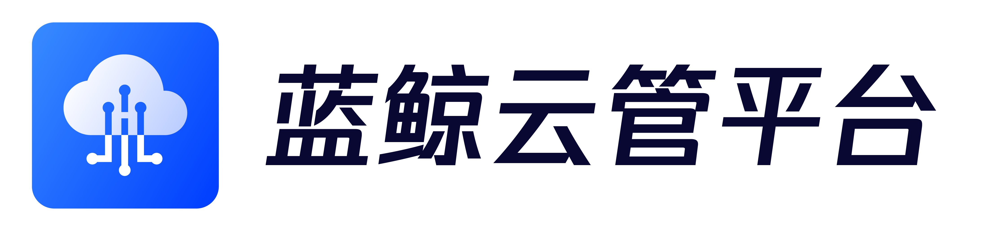

---

[(English Documents Available)](readme_en.md)

> **重要提示**: `master` 分支在开发过程中可能处于 *不稳定或者不可用状态* 。
> 请通过[releases](https://github.com/TencentBlueKing/bk-hcm/releases) 而非 `master` 去获取稳定的二进制文件。

蓝鲸云管理平台（BK-HCM）在蓝鲸体系下，为业务提供混合云架构下对IaaS层资源统一纳管与治理能力，同时具备部分PaaS服务的管理能力。在提升资源运营效率的同时，规范资源管理流程，辅助业务提效降本。

## Overview

* [设计理念](docs/overview/design.md)
* [架构设计](docs/overview/architecture.md)
* [代码目录](docs/overview/code_framework.md)

## Features

* 多云管理：支持多个公有云的资源管理，如腾讯云、华为云、亚马逊云、微软云、谷歌云等。
* 统一管理模式：统一多云的操作管理，降低用户的云使用门槛，提升业务效率。
* 生命周期管理：云资源的全生命周期管理，如购买、新建、操作配置、回收、销毁、释放等操作。
* 云账号管理：多云账号的纳管和API密钥托管。
* 云资源同步：与云上的资源实时同步。
* IaaS资源管理：对基础设施服务进行管理操作，如主机、硬盘、镜像、VPC、子网、安全组、网络接口、路由表的资源管理操作。
* PaaS资源管理：支持部分PaaS资源的管理，如CLB等。
* 简化权限管理：提供灵活的权限管理方式，屏蔽云上复杂的权限体系。
* 操作审计：用户操作行为的审计与回溯。

## Getting started

* [下载与编译](docs/overview/source_compile.md)
* [安装部署](docs/overview/installation.md)
* [API使用说明见这里](docs/api-docs)

## Roadmap

* [版本日志](docs/support-file/changelog/ch)

## Support

* [wiki](https://github.com/TencentBlueKing/bk-hcm/wiki)
* [白皮书](https://docs.bk.tencent.com/hcm/)
* [蓝鲸论坛](https://bk.tencent.com/s-mart/community)
* [蓝鲸 DevOps 在线视频教程](https://bk.tencent.com/s-mart/video/)
* [蓝鲸社区版交流1群](https://jq.qq.com/?_wv=1027&k=5zk8F7G)

## BlueKing Community

* [BK-CMDB](https://github.com/Tencent/bk-cmdb)：蓝鲸配置平台（蓝鲸 CMDB）是一个面向资产及应用的企业级配置管理平台。
* [BK-CI](https://github.com/Tencent/bk-ci)：蓝鲸持续集成平台是一个开源的持续集成和持续交付系统，可以轻松将你的研发流程呈现到你面前。
* [BK-BCS](https://github.com/Tencent/bk-bcs)：蓝鲸容器管理平台是以容器技术为基础，为微服务业务提供编排管理的基础服务平台。
* [BK-PaaS](https://github.com/Tencent/bk-PaaS)：蓝鲸PaaS平台是一个开放式的开发平台，让开发者可以方便快捷地创建、开发、部署和管理SaaS应用。
* [BK-SOPS](https://github.com/Tencent/bk-sops)：标准运维（SOPS）是通过可视化的图形界面进行任务流程编排和执行的系统，是蓝鲸体系中一款轻量级的调度编排类SaaS产品。

## Contributing

如果你有好的意见或建议，欢迎给我们提 Issues 或 Pull Requests，为蓝鲸开源社区贡献力量。关于bk-hcm分支管理、Issue 以及 PR 规范，
请阅读 [Contributing Guide](docs/CONTRIBUTING.md)。

[腾讯开源激励计划](https://opensource.tencent.com/contribution) 鼓励开发者的参与和贡献，期待你的加入。

## License

项目基于 MIT 协议，详细请参考 [LICENSE](LICENSE.txt)。

我们承诺未来不会更改适用于交付给任何人的当前项目版本的开源许可证（MIT 协议）。
