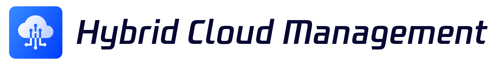

---

[(English Documents Available)](readme_en.md)

> **Note**: The `master` branch may be in an *unstable or even broken state* during development.
Please use [releases](https://github.com/TencentBlueKing/bk-hcm/releases) instead of the `master` branch in order to get stable binaries.

BlueKing Hybrid Cloud Management Platform (BK-HCM), under the Blue King ecosystem, provides unified management and governance capabilities for IaaS layer resources under a hybrid cloud architecture, while also having the ability to manage some PaaS services. By improving resource operation efficiency and standardizing resource management processes, it helps businesses enhance efficiency and reduce costs.

## Overview

* [Design philosophy (In Chinese)](docs/overview/design.md)
* [Architecture Design (In Chinese)](docs/overview/architecture.md)
* [code directory (In Chinese)](docs/overview/code_framework.md)

## Features

* Multi-cloud management: supports resource management for multiple public clouds, such as Tencent Cloud, Huawei Cloud, Amazon Web Services, Microsoft Azure, Google Cloud, and more.
* Unified management mode: a unified cross-cloud platform operation management mode, which reduces the cloud usage threshold for users and improves business efficiency.
* Lifecycle management: full lifecycle management of cloud resources, including purchase, creation, operation configuration, recovery, destruction, and release.
* Cloud account management: management and API key hosting for multiple cloud accounts.
* Cloud resource synchronization: synchronization with cloud resources in real-time.
* IaaS resource management: management of infrastructure services, such as host, disk, mirror, VPC, subnet, security group, network interface, route table resources, and operations.
* PaaS resource management: support for managing some PaaS resources, such as CLB.
* Simplified permission management: flexible permission management method, shielding complex permission systems on the cloud.
* Operation audit: audit and trace of user operation behaviors.

## Getting started

* [Download and Compile (In Chinese)](docs/overview/source_compile.md)
* [Installation and Deployment (In Chinese)](docs/overview/installation.md)
* API Instructions (In Chinese), [docs](docs/api-docs)
* [Replace Community Version with This Version](docs/overview/upgrade-from-ce.md)

## Roadmap

* [Changelog (In Chinese)](docs/support-file/changelog/release.md)

## Support

- [Wiki (In Chinese)](https://github.com/TencentBlueKing/bk-hcm/wiki) or ask for help
* [BK forum](https://bk.tencent.com/s-mart/community)
* [BK DevOps online video tutorial(In Chinese)](https://bk.tencent.com/s-mart/video/)
* Contact us, technical exchange QQ group：305496802

## BlueKing Community

* [BK-CMDB](https://github.com/Tencent/bk-cmdb)：blue whale configuration platform (BlueKing CMDB) is an enterprise-level configuration management platform for assets and applications.
- [BK-CI](https://github.com/Tencent/bk-ci)：a continuous integration and continuous
 delivery system that can easily present your R & D process to you.
* [BK-BCS](https://github.com/Tencent/bk-bcs)：a basic container service platform which provides
 orchestration and management for micro-service business.
* [BK-PaaS](https://github.com/Tencent/bk-PaaS)：an development platform that allows developers to create, develop, deploy and manage SaaS applications easily and quickly.
* [BK-SOPS](https://github.com/Tencent/bk-sops)：an lightweight scheduling SaaS  for task flow
 scheduling and execution through a visual graphical interface.

## Contributing

If you have good ideas or suggestions, please let us know by Issues or Pull Requests and contribute to the BlueKing
 Open Source Community. For HCM branch management, issues, and pr specifications, read the
 [Contributing Guide](docs/CONTRIBUTING.md)。

If you are interested in contributing, check out the [CONTRIBUTING.md], also join our
 [Tencent OpenSource Plan](https://opensource.tencent.com/contribution).

## License

Bk-cmdb is based on the MIT license. Please refer to [LICENSE](LICENSE) for details.

We undertake not to change the open source license (MIT license) applicable to the current version of the project delivered to anyone in the future.
